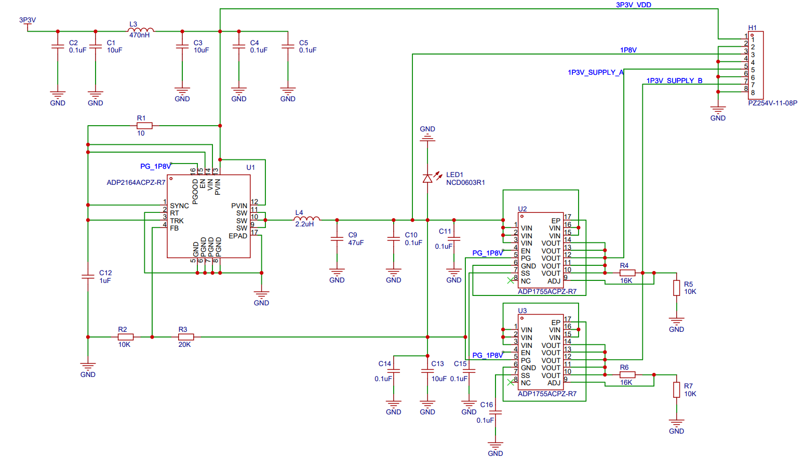

# Meteo Power Supply Module Manual

## 1. Descriptions

### 1.1 ADP2164

The ADP2164 is a 4A,synchronous,step-down,dc-to-dc regulator.

  

<b>Figure. ADP2164 Pin Configuration</b>

The reference design circuit from ADP2164 datasheet figure 43 is as follows.

  

In this `Meteo Power Supply Module`, the circuit and its connections are described as follows.

| Pin No. |  Mnemonic   | Descriptions                                              |
| ------- | :---------: | --------------------------------------------------------- |
| 1       |    SYNC     | connected to VIN                                          |
| 2       |     RT      | connected to GND,the switching frequency is set to 600kHz |
| 3       |     TRK     |                                                           |
| 4       |     FB      | Connect this pin to a resistor from $V_{out}$             |
| 5       |     GND     | Analog Ground                                             |
| 6,7,8   |    PGND     | Power Ground                                              |
| 9,10,11 |     SW      | Switch Node output.Connect to the output inductor         |
| 12,13   |    PVIN     | Power Input PIn                                           |
| 14      |     VIN     | Bias Voltage Input Pin.                                   |
| 15      |     EN      | Precision Enable Pin                                      |
| 16      |    PGOOD    | Power-Good Output                                         |
| 17      | Exposed Pad |                                                           |

**Output voltage selction**

$$
V_{out}=0.6\times \left( 1+\frac{R_{TOP}}{R_{BOT}} \right) 
$$

### 1.2 ADP1755

  

| Pin No.        | Mnemonic | Descriptions                                                        |
| -------------- | :------: | ------------------------------------------------------------------- |
| 1,2,3,15,16    |   VIN    | connected to VIN                                                    |
| 4              |    EN    | Enable Input                                                        |
| 5              |    PG    | Power Good                                                          |
| 6              |   GND    | Ground                                                              |
| 7              |    SS    | Soft Start                                                          |
| 8              |    NC    | Not connected                                                       |
| 9              |   ADJ    | Adjust.A resistor divider from VOUT to ADJ sets the output voltage. |
| 10,11,12,13,14 |   VOUT   |
| 17             |   EPAD   | The exposed pad                                                     |

The reference design circuit from ADP1755 datasheet figure 43 is as follows.

  

$$
V_{out}=0.5V\times \left( 1+\frac{R1}{R2} \right) 
$$

## 2. General Description of Meteo Power Supply Module

The Block Diagram of this power Ssupply module which is the recommend method in AD9364 datasheet is as follows.

  

**The schematic is as follows.**

